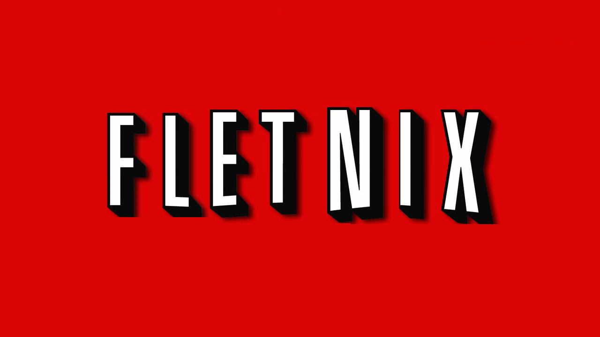

# Fletnix Fullstack Web Application

Fletnix is a content searching service application, featuring a robust MEAN stack architecture. The backend, implemented with Node.js and Express, efficiently manages content and user data, supported by MongoDB. A Python script was used to transforms CSV data into JSON for seamless database integration. Authentication is secured via JWT for optimal safety.

The front-end, crafted with Angular, offers a Netflix-like user interface, complete with features like multi-profile creation for subscribers, advanced search capabilities, category classification, and pagination.

## Key Features

- User Authentication with JWT
- CSV to JSON data conversion for MongoDB
- Advanced Content Management API
- Angular-based Frontend resembling Netflix UI
- Multi-profile support for users
- Efficient Search and Category Filtering
- Responsive and Intuitive Pagination

## API Documentation

Comprehensive API documentation is available in our Postman workspace, accessible [here](https://galactic-escape-881292.postman.co/workspace/aa1aab03-812c-46fb-9308-0a8d209aa6db).

---

Developed with 💻 and ☕ by [Syed Moin Ahmed](https://syedmoinahmed.dev/).
